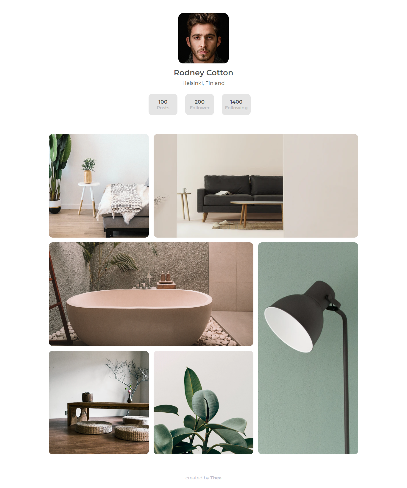

<!-- Please update value in the {}  -->

<h1 align="center">My gallery</h1>

<!-- TABLE OF CONTENTS -->

## Table of Contents

- [Overview](#overview)
- [Built With](#built-with)
- [Features](#features)
- [Contact](#contact)
- [Acknowledgements](#acknowledgements)

<!-- OVERVIEW -->

## Overview

## Features

<!-- List the features of your application or follow the template. Don't share the figma file here :) -->

This application/site was created as a submission to a [DevChallenges](https://devchallenges.io/challenges) challenge. The [challenge](https://devchallenges.io/challenges/gcbWLxG6wdennelX7b8I) was to build an application to complete the given user stories.

## Contact

- Website [teona.dev](https://www.teona.dev/)
- GitHub [@highflyer910](https://github.com/highflyer910)
- Twitter [@highflyer910](https://twitter.com/highflyer910)
